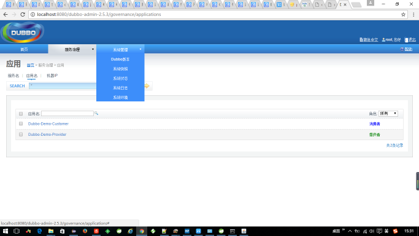

#
Dubbo实战之一：Dubbo入门实例

## Dubbo简介
Dubbo是阿里巴巴出品的一款分布式的SOA服务治理框架，致力于提供高性能和透明化的RPC(Remote Procedure Call Protocol)远程调用的解决方案，以及SOA服务治理方案。

简单的说，Dubbo就是个服务框架，如果没有分布式的需求，其实是不需要用的，只有在分布式的时候，才有dubbo这样的分布式服务框架的需求，并且它本质上是一个服务调用的产品，**说白了就是个远程服务调用的分布式框架（告别了Web Service模式中的wsdl，通过服务者和消费者的方式在dubbo上注册，从而达到远程服务调用的目的）**

### dubbo的核心部分包含：
1. 远程通讯： 提供对多种基于长连接的NIO框架的抽象封装，包括多种线程模型，序列化以及“请求-响应机制的信息交换方式”；
2. 集群容错： 提供基于接口方法的透明过程的远程过程调用， 包括多协议支持，以及软负载均衡、失败容错、地址路由、动态配置等集群支持
3. 自动发现： 基于注册中心目录服务，使服务消费方能够动态的查找服务提供方，使得地址提供方可以平滑的增加或者减少机器

### dubbo的应用场景
1. 透明化的远程方法调用，就像调用本地方法一样调用远程方法，只需简单配置，没有任何API侵入。      
2. 软负载均衡及容错机制，可在内网替代F5等硬件负载均衡器，降低成本，减少单点。
3. 服务自动注册与发现，不再需要写死服务提供方地址，注册中心基于接口名查询服务提供者的IP地址，并且能够平滑添加或删除服务提供者。
### 最为诱人的地方在于，Dubbo采用全Spring配置方式，透明化的接入应用，对应用没有任何的API侵入，只要配置Spring加载dubbo的配置即可。

### dubbo架构
在dubbo官网上，有一张图

图中罗列了五个基本的节点角色：

		   Provider: 暴露服务的服务提供方。
	
	       Consumer: 调用远程服务的服务消费方。
	
	       Registry: 服务注册与发现的注册中心。
	
	       Monitor: 统计服务的调用次调和调用时间的监控中心。
	
	       Container: 服务运行容器。

调用关系如下：

			0.服务容器负责启动，加载，运行服务提供者。
			1.服务提供者在启动时，向注册中心注册自己提供的服务。
			2.服务消费者在启动时，向注册中心订阅自己所需的服务。
			3.注册中心返回服务提供者地址列表给消费者，如果有变更，
				注册中心将基于长连接推送变更数据给消费者。
			4.服务消费者，从提供者地址列表中，基于软负载均衡算法，
				选一台提供者进行调用，如果调用失败，再选另一台调用。
			5.服务消费者和提供者，在内存中累计调用次数和调用时间，
				定时每分钟发送一次统计数据到监控中心。

## 使用方法
简单介绍了dubbo的原理及架构，我们直接用一个例子来讲述dubbo如何使用。

### 1. 下载zookeeper注册中心
dubbo官方推荐使用zookeeper作为服务的注册中心，zookeeper也是经历了生产实践考验的一款注册中心。

下载zookeeper注册中心，下载地址： 下载后解压即可，进入D:\apach-zookeeper-3.4.5\bin，

双击zkServer.cmd启动注册中心服务。

控制台打印如下内容表明正确启动

			2016-10-18 14:51:50,448 [myid:] - INFO  [main:Environment@100] - Server environment:java.compiler=<NA>
			2016-10-18 14:51:50,451 [myid:] - INFO  [main:Environment@100] - Server environment:os.name=Windows 10
			2016-10-18 14:51:50,458 [myid:] - INFO  [main:Environment@100] - Server environment:os.arch=amd64
			2016-10-18 14:51:50,465 [myid:] - INFO  [main:Environment@100] - Server environment:os.version=10.0
			2016-10-18 14:51:50,471 [myid:] - INFO  [main:Environment@100] - Server environment:user.name=Administrator
			2016-10-18 14:51:50,474 [myid:] - INFO  [main:Environment@100] - Server environment:user.home=C:\Users\Administrator
			2016-10-18 14:51:50,477 [myid:] - INFO  [main:Environment@100] - Server environment:user.dir=D:\zookeeper-3.4.6\zookeeper-3.4.6\bin
			2016-10-18 14:51:50,482 [myid:] - INFO  [main:ZooKeeperServer@755] - tickTime set to 2000
			2016-10-18 14:51:50,486 [myid:] - INFO  [main:ZooKeeperServer@764] - minSessionTimeout set to -1
			2016-10-18 14:51:50,489 [myid:] - INFO  [main:ZooKeeperServer@773] - maxSessionTimeout set to -1
			2016-10-18 14:51:50,611 [myid:] - INFO  [main:NIOServerCnxnFactory@94] - binding to port 0.0.0.0/0.0.0.0:2181

### 编写服务生产者

#### 1. 服务接口及实现

		public interface DubboService {
			
			public String sayHello(String name);
			
			public List<Person> getUsers();
		}
	
		public class DubboServiceImpl implements DubboService {
	
			@Override
			public String sayHello(String name) {
				return "hello " + name;
			}
		
			@Override
			public List<Person> getUsers() {
				List<Person> aVers = new ArrayList<>();
				try {
					Person aVer1 = new AVer(1, "xxxx", "HMP", "xxxx", new SimpleDateFormat("yyyy-MM-dd").parse("1987-11-23"));
					Person aVer2 = new AVer(2, "yyyy", "TokyoHot", "yyyy", new SimpleDateFormat("yyyy-MM-dd").parse("1987-11-23"));
					Person aver3 = new AVer(3, "zzzz", "AtHoneys", "zzzz", new SimpleDateFormat("yyyy-MM-dd").parse("1986-10-28"));
					Person aver4 = new AVer(4, "aaaa", "T-poweres.", "aaaa", new SimpleDateFormat("yyyy-MM-dd").parse("1988-02-21"));
					Person aver5 = new AVer(5, "bbbb", "UNKNOWN", "bbbb", new SimpleDateFormat("yyyy-MM-dd").parse("1986-10-29"));
					aVers.add(aVer1);
					aVers.add(aVer2);
					aVers.add(aver3);
					aVers.add(aver4);
					aVers.add(aver5);
				} catch (ParseException e) {
					e.printStackTrace();
				}
				return aVers;
			}
		}
#### 2. 编写服务启动类，通过ClasspathXmlApplicationContext启动应用并在注册中心注册
		/**
		 * 
		 * @author snowalker
		 * @描述 生产者启动器
		 * @date 	2016年10月18日
		 */
		public class ApplicationRunner {
		
			public static void main(String[] args) throws IOException {
				ClassPathXmlApplicationContext applicationContext = 
						new ClassPathXmlApplicationContext("applicationContext.xml");
				applicationContext.start();
				System.in.read();		//为保证服务一直开启，利用输入流的阻塞模拟
			}
		}
#### 3. 第三步也是比较重要的一步，编写dubbo配置文件，整合Spring
		<?xml version="1.0" encoding="UTF-8"?>
		<beans xmlns="http://www.springframework.org/schema/beans"
			xmlns:xsi="http://www.w3.org/2001/XMLSchema-instance"
			xmlns:mvc="http://www.springframework.org/schema/mvc"
			xmlns:context="http://www.springframework.org/schema/context"
			xmlns:aop="http://www.springframework.org/schema/aop"
			xmlns:tx="http://www.springframework.org/schema/tx"
			xmlns:dubbo="http://code.alibabatech.com/schema/dubbo"
			xsi:schemaLocation="http://www.springframework.org/schema/beans 
				http://www.springframework.org/schema/beans/spring-beans-3.0.xsd 
				http://www.springframework.org/schema/mvc 
				http://www.springframework.org/schema/mvc/spring-mvc-3.0.xsd 
				http://www.springframework.org/schema/context 
				http://www.springframework.org/schema/context/spring-context-3.0.xsd 
				http://www.springframework.org/schema/aop 
				http://www.springframework.org/schema/aop/spring-aop-3.0.xsd 
				http://www.springframework.org/schema/tx 
				http://www.springframework.org/schema/tx/spring-tx-3.0.xsd 
				http://code.alibabatech.com/schema/dubbo
		        http://code.alibabatech.com/schema/dubbo/dubbo.xsd
		        ">	
			
			<!-- 具体的实现bean -->
			<bean id="dubboService" class="com.snowalker.dubbo.service.DubboServiceImpl" /> 
		
			<!-- 提供方应用信息，用于计算依赖关系 -->
			<dubbo:application name="Dubbo-Demo-Provider" />
		
			<!-- 使用zookeeper注册中心暴露服务地址 -->
			<dubbo:registry address="zookeeper://127.0.0.1:2181" />
		
			<!-- 用dubbo协议在20880端口暴露服务 -->
			<dubbo:protocol name="dubbo" port="20880" />
		
			<!-- 声明需要暴露的服务接口 -->
			<dubbo:service interface="com.snowalker.dubbo.service.DubboService"
				ref="dubboService" />
		
		</beans>

#### 解释
1. 通过配置的方式将服务实现类注入容器
2. 在本地zookeeper实例中暴露服务地址，2181为zookeeper默认端口
3. 用dubbo协议在20880端口暴露服务
4. 声明服务接口并将引用指向服务的实现类

**这里IDE可能会报XML错误，这是命名空间加载的问题，对运行没有影响**

### 这里生产者便编写完毕，接着编写消费者

### 编写服务消费者

服务的消费者写起来很简单
#### 1. 定义服务接口，和服务生产者的接口内容一致
		public interface DubboService {
			
			public String sayHello(String name);
			
			public List<Person> getUsers();
		}
#### 2. 配置消费者，编写配置文件
			<?xml version="1.0" encoding="UTF-8"?>
			<beans xmlns="http://www.springframework.org/schema/beans"
				xmlns:xsi="http://www.w3.org/2001/XMLSchema-instance" xmlns:dubbo="http://code.alibabatech.com/schema/dubbo"
				xsi:schemaLocation="http://www.springframework.org/schema/beans
			        http://www.springframework.org/schema/beans/spring-beans.xsd
			        http://code.alibabatech.com/schema/dubbo
			        http://code.alibabatech.com/schema/dubbo/dubbo.xsd
			        ">
			
				<!-- 消费方应用名，用于计算依赖关系，不是匹配条件，不要与提供方一样 -->
				<dubbo:application name="Dubbo-Demo-Customer" />
			
				<!-- 使用zookeeper注册中心暴露服务地址 -->
				<dubbo:registry address="zookeeper://127.0.0.1:2181" />
			
				<!-- 生成远程服务代理，可以像使用本地bean一样使用demoService -->
				<dubbo:reference id="dubboService"
					interface="com.snowalker.dubbo.service.DubboService" />
			
			</beans>

#### 解释
1. 在服务注册中心zookeeper暴露服务地址
2. 生成服务代理，代理id为生产中声明的服务id，接口为本地接口
#### 3. 定义消费者服务启动类
		public class ConsumerApplication {
			
			public static void main(String[] args) throws IOException {
				ClassPathXmlApplicationContext applicationContext =
						new ClassPathXmlApplicationContext("applicationContext.xml");
				applicationContext.start();
				
				DubboService dubboService = 
						(DubboService) applicationContext.getBean("dubboService");
				//方法调用
				String say = dubboService.sayHello("snowalker");
				System.out.println(say);
				
				List<AVer> aVers = dubboService.getUsers();
				for (AVer aVer : aVers) {
					System.out.println(aVer.toString());
				}
				System.in.read();
			}
		}

#### 解释
1. 加载配置文件，使用ClassPathXmlApplicationContext不多解释
2. 通过start()启动容器
3. 从容器中取出服务bean，进行远程调用，就像本地调用一样。

### 测试
1. 先启动服务生产者，注册服务
2. 启动服务消费者，消费服务，控制台看到如下结果

			2016-10-18 15:26:42,126 INFO [com.alibaba.dubbo.registry.zookeeper.ZookeeperRegistry] -  [DUBBO] Register: consumer://192.168.80.1/com.snowalker.dubbo.service.DubboService?application=Dubbo-Demo-Customer&category=consumers&check=false&dubbo=2.5.2&interface=com.snowalker.dubbo.service.DubboService&methods=sayHello,getUsers&pid=16536&side=consumer&timestamp=1476775592641, dubbo version: 2.5.2, current host: 192.168.80.1
			2016-10-18 15:26:42,162 INFO [com.alibaba.dubbo.registry.zookeeper.ZookeeperRegistry] -  [DUBBO] Subscribe: consumer://192.168.80.1/com.snowalker.dubbo.service.DubboService?application=Dubbo-Demo-Customer&category=providers,configurators,routers&dubbo=2.5.2&interface=com.snowalker.dubbo.service.DubboService&methods=sayHello,getUsers&pid=16536&side=consumer&timestamp=1476775592641, dubbo version: 2.5.2, current host: 192.168.80.1
			2016-10-18 15:26:42,238 INFO [com.alibaba.dubbo.registry.zookeeper.ZookeeperRegistry] -  [DUBBO] Notify urls for subscribe url consumer://192.168.80.1/com.snowalker.dubbo.service.DubboService?application=Dubbo-Demo-Customer&category=providers,configurators,routers&dubbo=2.5.2&interface=com.snowalker.dubbo.service.DubboService&methods=sayHello,getUsers&pid=16536&side=consumer&timestamp=1476775592641, urls: [dubbo://192.168.80.1:20880/com.snowalker.dubbo.service.DubboService?anyhost=true&application=Dubbo-Demo-Provider&dubbo=2.5.2&interface=com.snowalker.dubbo.service.DubboService&methods=sayHello,getUsers&pid=15556&side=provider&timestamp=1476775564256, empty://192.168.80.1/com.snowalker.dubbo.service.DubboService?application=Dubbo-Demo-Customer&category=configurators&dubbo=2.5.2&interface=com.snowalker.dubbo.service.DubboService&methods=sayHello,getUsers&pid=16536&side=consumer&timestamp=1476775592641, empty://192.168.80.1/com.snowalker.dubbo.service.DubboService?application=Dubbo-Demo-Customer&category=routers&dubbo=2.5.2&interface=com.snowalker.dubbo.service.DubboService&methods=sayHello,getUsers&pid=16536&side=consumer&timestamp=1476775592641], dubbo version: 2.5.2, current host: 192.168.80.1
			2016-10-18 15:26:42,414 INFO [com.alibaba.dubbo.remoting.transport.AbstractClient] -  [DUBBO] Successed connect to server /192.168.80.1:20880 from NettyClient 192.168.80.1 using dubbo version 2.5.2, channel is NettyChannel [channel=[id: 0x2d7275fc, /192.168.80.1:55305 => /192.168.80.1:20880]], dubbo version: 2.5.2, current host: 192.168.80.1
			2016-10-18 15:26:42,415 INFO [com.alibaba.dubbo.remoting.transport.AbstractClient] -  [DUBBO] Start NettyClient SnoWalker-PC/192.168.80.1 connect to the server /192.168.80.1:20880, dubbo version: 2.5.2, current host: 192.168.80.1
			2016-10-18 15:26:42,492 INFO [com.alibaba.dubbo.config.AbstractConfig] -  [DUBBO] Refer dubbo service com.snowalker.dubbo.service.DubboService from url zookeeper://127.0.0.1:2181/com.alibaba.dubbo.registry.RegistryService?anyhost=true&application=Dubbo-Demo-Customer&check=false&dubbo=2.5.2&interface=com.snowalker.dubbo.service.DubboService&methods=sayHello,getUsers&pid=16536&side=consumer&timestamp=1476775592641, dubbo version: 2.5.2, current host: 192.168.80.1
			hello snowalker
			AVer [id=1, name=xxx, company=HMP, feature=yyy, birthday=Mon Nov 23 00:00:00 CST 1987]
			AVer [id=2, name=xxx, company=TokyoHot, feature=yyy, birthday=Mon Nov 23 00:00:00 CST 1987]
			AVer [id=3, name=xxx, company=AtHoneys, feature=yyy, birthday=Tue Oct 28 00:00:00 CST 1986]
			AVer [id=4, name=xxx, company=T-poweres., feature=yyy, birthday=Sun Feb 21 00:00:00 CST 1988]
			AVer [id=5, name=xxx, company=UNKNOWN, feature=yyy, birthday=Wed Oct 29 00:00:00 CST 1986]
	
### 小结
可以看到我们的服务调用成功，就像调用本地的服务一样。

这里再稍微介绍一下dubbo-admin的使用，首先下载dubbo-admin-2.5.3.war，最好使用jdk1.7加载否则会报错需要自行构建。

下载好war包之后将其部署进tomcat的webapp下，默认的密码为root root。

运行容器访问http://localhost:8080/dubbo-admin-2.5.3/，这里会提示输入用户名密码，全部输入root root。进入管理界面，如下图

能够看到我们的服务生产者消费者都置于其的管理之下。更多的使用技巧和进阶技术在之后的文章将会继续讲解，敬请期待！

